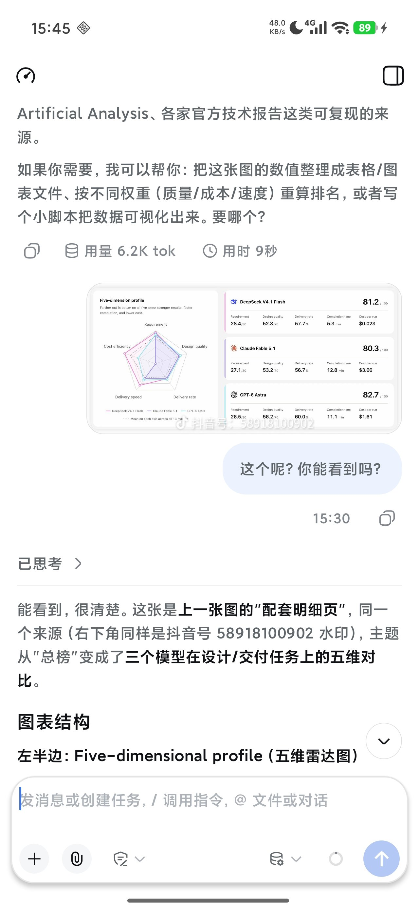
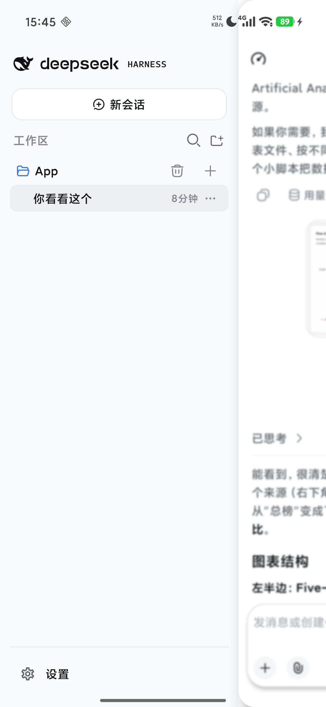
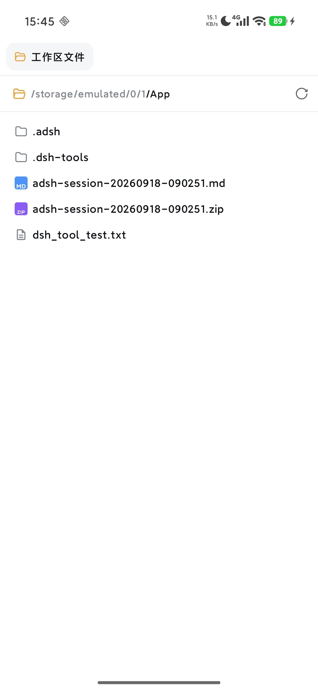
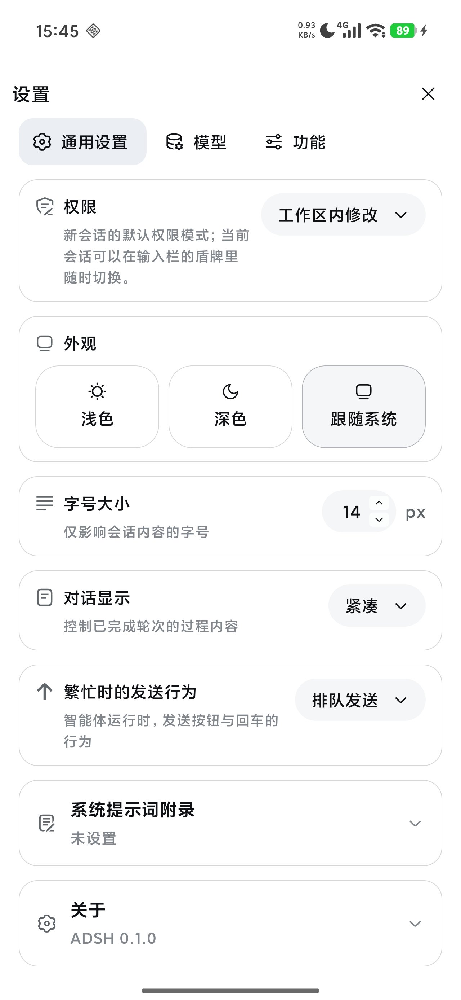

# ADSH

（不知你有没有发现：linux也就是使用bash的deepseek 模型表现会比用pwsh时聪明很多，众多用户早已发现，pwsh正在肘击模型，而本软件内嵌的termux用的正是原生bash，哈哈）

DeepSeek Harness（dsh）的安卓原生客户端：**dsh + DeepSeek App 的界面风格**，把 dsh 的原版工具
**静态化**搬进 App —— 没有 Node 运行时、没有插件加载、没有运行期下载。

- Kotlin + Jetpack Compose 单 Activity，界面按 dsh / DeepSeek App 的视觉规范逐项对齐
- 工具 13 个（原版语义）：`run_code`（PTC / QuickJS + TypeScript SDK）、`bash`、`read`、`write`、
  `edit`、`glob`、`grep`、`todo_write`、`present`、`web_search`、`web_fetch`、
  `ask_user_question`、`exit_plan_mode`
  - 契约逐条对着 dsh 的 PTC 源码核过：`tools:sdk` 声明、`ToolCallError`（`name` / `toolName`）、
    输出 schema、异常与错误码、截断方向与上限（bash 留尾部、glob 100 条、grep 250 条）……
    有意偏离 dsh 的地方都写在 `docs/UI-v6-report.md` 里，不藏着
- 内置 Termux 用户态（bootstrap 静态入包，**前缀就是官方前缀**）：`bash` 与随包分发的 CLI 工具可直接运行，
  无需 root / proot；按官方流程跑完 bootstrap second stage（各包 postinst），所以 `apt` / `pkg` / `dpkg`
  与 `update-alternatives`、CA 证书、`ld.so.cache` 都是「装好即可用」的状态
- 工作区：SAF 选目录 + 「所有文件访问」拿真实路径，bash 与文件工具能直接操作手机文件夹
- 会话：流式正文与思考过程、工具调用轨迹（含 PTC 子调用）、用量与用时、计划模式、上下文压缩；
  附件支持文件与图片（按**设备能力**识别 png / jpeg / gif / webp / bmp / heic / avif，
  再等比缩放进请求的像素与字节预算）
- 模型：官方 DeepSeek（`deepseek-flash` 原生多模态 / `deepseek-v4-pro`）+
  **供应方目录**（OpenAI、OpenRouter、Kimi、智谱、通义、小米、xAI、Groq、Mistral、Together、
  Fireworks、NVIDIA、Hugging Face、Cerebras、Baseten、Ant Ling… 选一个、贴上密钥即可），
  同时支持手写自定义提供方
- 限制对齐 dsh：并行工具调用 `agent-loop.maxParallelToolCalls`（默认 10）、
  终端 `shell.timeoutMs` / `maxTimeoutMs` / `maxOutputBytes`

## 截图

<p align="center">
  
  
  
  
</p>

## 安装

下载 [`dist/ADSH-0.1.0-release.apk`](dist/ADSH-0.1.0-release.apk)：arm64-v8a，Android 8.0（API 26）以上。
包名 **`com.termux`**；release 已开 R8（`minifyEnabled` + `shrinkResources`）。

> ### ⚠️ 本软件不能与 Termux 共存
> 本应用的包名**就是 `com.termux`**：Termux 的二进制、dpkg 数据库、`.deb` 里的 shebang 都把
> `/data/data/com.termux/files/usr` 编译死在程序里，而官方明确「前缀安装后不可重定位」，
> 所以只有包名保持 `com.termux`，官方前缀才真实存在。
>
> 结果是：**手机上有官方 Termux（或任何 `com.termux` 应用）时，必须先卸载它**才能安装本应用
> （同包名、签名不同，无法覆盖安装）；反过来装了本应用之后也装不上官方 Termux，
> 要装就得卸载本应用。两者共用同一个数据目录但格式互不兼容 —— 卸载本应用等于清空内置用户态，
> 里面 `apt` 装过的东西都要重装。

## 在手机上开发（工作区 vs 构建目录）

- **工作区**（你绑定的手机文件夹）在 Android 的外部存储上，只能读写普通文件：建不了符号链接、
  置不了执行位、`chmod` 不生效、里面的文件也不能被执行。放素材和最终产物没问题。
- **重活**（`npm install` / `pip install` / 构建 / git / 任何要建软链或执行生成物的步骤）请放到
  `$ADSH_SCRATCH`（= `$HOME/scratch`，f2fs；App 每次启动建好并导出），做完把产物拷回工作区。
- 其余约定：`$ADSH_WORKSPACE` 始终指向当前工作区；`/tmp` 自动映射到 `$TMPDIR`（`$PREFIX/tmp`）；
  工作区里的 `git` 已预置 `safe.directory`；`apt` / `pip` / `npm` 已指向可用镜像。

## 构建

JDK 17 + Android SDK 37：

```bash
./gradlew :app:assembleRelease
```

`app/src/main/assets/bootstrap/*.zip`（Termux bootstrap，`scripts/fetch-bootstrap.sh`）与
`app/src/main/execLibs/`（`scripts/prepare-execlibs.py` 从 bootstrap 生成的可执行文件副本）没有入库
（见 `.gitignore`），要构建出能跑的包需先备好这两项。
**`execLibs/` 里的文件必须原样复制**：包名是 `com.termux` 时构建脚本不做任何前缀改写
（它们运行期从 `nativeLibraryDir` 执行，改文本只会把编译期前缀改成不存在的路径）。
实现细节与逐轮验证记录见 `docs/`（最新两节是方案 A 的 applicationId 切换与它带来的三个真机坑）。

## 许可

MIT
