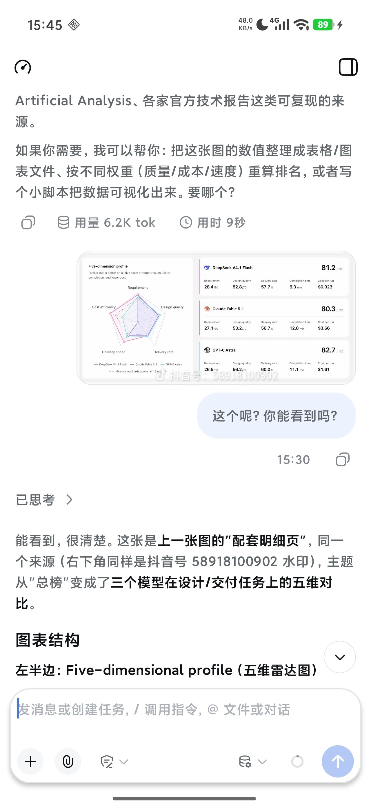
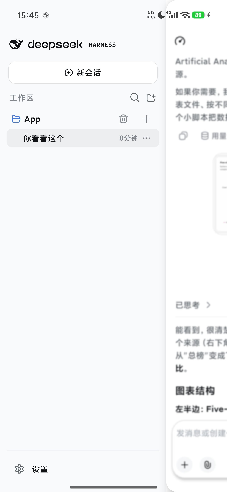
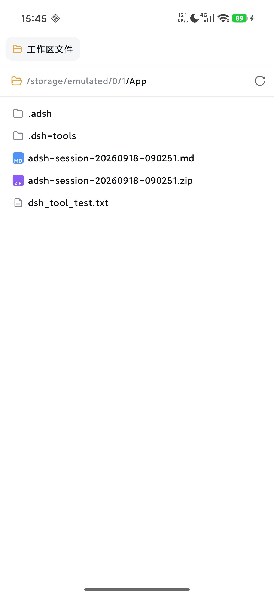
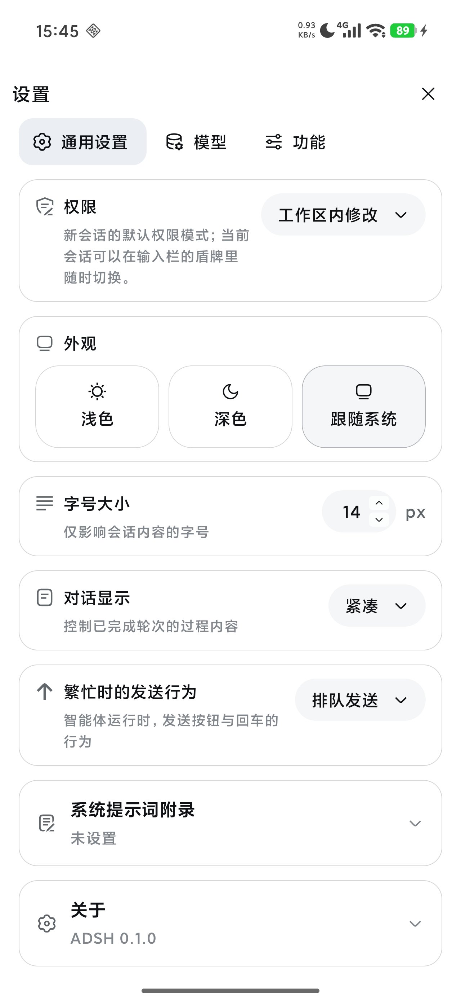

# ADSH

DeepSeek Harness（dsh）的安卓原生客户端：**dsh 的 PTC 工具语义 + DeepSeek App 的界面风格**，
没有 Node 运行时、没有插件加载、没有运行期下载。

- Kotlin + Jetpack Compose 单 Activity，界面按 dsh / DeepSeek App 的视觉规范逐项对齐
- dsh 的原版工具（`bash`、`read`、`read_image`、`write`、`edit`、`glob`、`grep`、`todo_write`、
  `present`、`web_search`、`web_fetch`、`ask_user_question`、`exit_plan_mode`，共 13 个）加上 `run_code`
  一共 14 个，但**只有 `run_code` 能被模型直接调用** —— 其余在系统提示词的 `tools:sdk` 段声明、
  由程序内 `await tools.<name>(args)` 组合调用（PTC / QuickJS），`ToolCallError` 与输出 schema
  都对着 dsh 源码核过
- 内嵌 Termux 用户态（bootstrap 静态入包，前缀就是官方前缀 `/data/data/com.termux/files/usr`）：
  `bash` 与随包分发的 CLI 工具直接可跑，无需 root / proot
- 工作区用 SAF 选目录；流式正文与思考、工具调用轨迹（含子调用）、计划模式、上下文压缩、
  用量与用时、文件与图片附件
- 模型：官方 DeepSeek（含原生多模态）与常见供应方目录，贴密钥即用

## 截图

<p align="center">
  
  
  
  
</p>

## 安装

下载 [`ADSH-0.2.1-release.apk`](https://github.com/yuyuyuyulike/ADSH/releases/download/v0.2.1-20261004/ADSH-0.2.1-release.apk)：
arm64-v8a，Android 8.0（API 26）以上；release 已开 R8（minify + shrink）。
新版本都发在 [Releases](https://github.com/yuyuyuyulike/ADSH/releases) 页，那里始终是最新那一份。

> **不能与官方 Termux 共存**：本应用的包名就是 `com.termux`（Termux 的前缀路径编译死在二进制里，
> 官方明确「安装后不可重定位」）。装之前要先卸载官方 Termux，反之亦然；两者共用同一个数据目录，
> 卸载本应用等于清空内置用户态。

## 手机上怎么放东西

- **工作区**（你绑定的文件夹）在 Android 外部存储上：只能读写普通文件 —— 建不了软链、置不了执行位、
  不能执行里面的文件，适合放素材与最终产物。
- **重活**（`npm install` / 构建 / git）放到 `$ADSH_SCRATCH`（= `$HOME/scratch`），做完把产物拷回工作区；
  `$ADSH_WORKSPACE` 始终指向当前工作区，`/tmp` 就是 `$TMPDIR`。
- `targetSdk` 有意钉在 28（与官方 Termux 一样，见 [HANDOFF.md](HANDOFF.md)）：
  代价是上不了 Google Play，本项目只走 GitHub Release 侧载。

## 构建

JDK 17 + Android SDK 37 + NDK 28；先跑 `scripts/prepare-assets.sh` 备好随包资源
（`assets/bootstrap/*.zip`、`execLibs/librg.so` / `libbash.so`，都在 `.gitignore` 里，且必须原样复制）。

```bash
cmd.exe /c "scripts\build-debug.bat :app:testDebugUnitTest :app:assembleRelease"
```

实现细节、平台约束与有意偏离 dsh 的地方见 [HANDOFF.md](HANDOFF.md)。

## 许可

MIT
